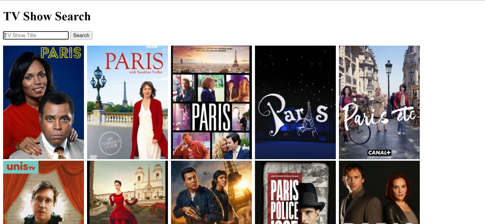

# TV Show Search

## Project Overview

The **TV Show Search** project is a simple web application that allows users to search for TV shows using the TVmaze API. Users can input a TV show title, and the application will display images of matching shows. The project is built with **HTML**, **CSS**, and **JavaScript**, utilizing the **Axios** library for making HTTP requests.

## Features

- **Search Functionality**: Users can enter a TV show title, and the app will fetch and display images of relevant shows.
- **Responsive Design**: The layout is designed to work on various screen sizes, providing a user-friendly experience.
- **Dynamic Content**: The app updates the content on the page without refreshing, thanks to JavaScript.

## Technologies Used

- **HTML5**: For structuring the web page.
- **CSS3**: For styling the layout and presentation of the application.
- **JavaScript**: For adding interactivity and handling API requests.
- **Axios**: A promise-based HTTP client for making API requests.

## File Structure

```bash
tv-shows/
│
├── index.html    # Main HTML file for the TV Show Search app
├── app.js        # JavaScript file for handling the search functionality
└── app.css       # CSS file for styling the layout and results
```

## Setup Instructions

### 1. Clone the Repository

To get a local copy of the repository, clone it using Git:

```bash
git clone https://github.com/EmokeVagyas/tv-shows.git
```

### 2. Navigate to the Project Directory

```bash
cd tv-shows
```

### 3. Open the Project

Open `index.html` in a browser to view the application:

```bash
open index.html
```

## Code Explanation

### index.html

The `index.html` file serves as the main structure of the web application. It includes a form for user input and a section to display search results. The form captures the TV show title and triggers a search when submitted.

```html
<!DOCTYPE html>
<html lang="en">

<head>
    <meta charset="UTF-8">
    <meta name="viewport" content="width=device-width, initial-scale=1.0">
    <title>TV Show Search</title>
    <script src="https:/cdn.jsdelivr.net/npm/axios/dist/axios.min.js"></script>
    <link rel="stylesheet" href="app.css">
</head>

<body>
    <h1>TV Show Search</h1>
    <form id="searchForm">
        <input type="text" placeholder="TV Show Title" name="query">
        <button>Search</button>
        <div id="results"></div>
    </form>
    <script src="app.js"></script>
</body>

</html>
```

### app.js

The `app.js` file contains the logic for handling the search form submission and fetching data from the TVmaze API. When the form is submitted, it prevents the default behavior, extracts the search term, and makes a GET request to the API. The response data is then passed to the `makeImages` function to display the show images.

```javascript
const form = document.querySelector('#searchForm');
form.addEventListener('submit', async function (e) {
    e.preventDefault();
    const searchTerm = form.elements.query.value;
    const config = { params: { q: searchTerm } };
    const res = await axios.get(`http://api.tvmaze.com/search/shows?q=${searchTerm}`, config);
    makeImages(res.data);
    form.elements.query.value = '';
});

const makeImages = (shows) => {
    document.getElementById('results').innerHTML = '';

    for (let result of shows) {
        if (result.show.image) {
            const img = document.createElement('IMG');
            img.src = result.show.image.medium;
            document.getElementById('results').append(img);
        }
    }
};
```

### app.css

The `app.css` file is responsible for styling the results section and images. It adds padding and spacing to create a visually appealing layout.

```css
#results {
    padding-top: 1rem;
}

body img {
    padding-right: 8px;
}
```

## Screenshots

### TV Show Search


## License

This project is licensed under the MIT License - see the [LICENSE](LICENSE) file for details.

## Contact

Created by **Emoke Vagyas** - [GitHub](https://github.com/EmokeVagyas) - feel free to reach out for any questions or collaborations!
